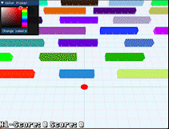
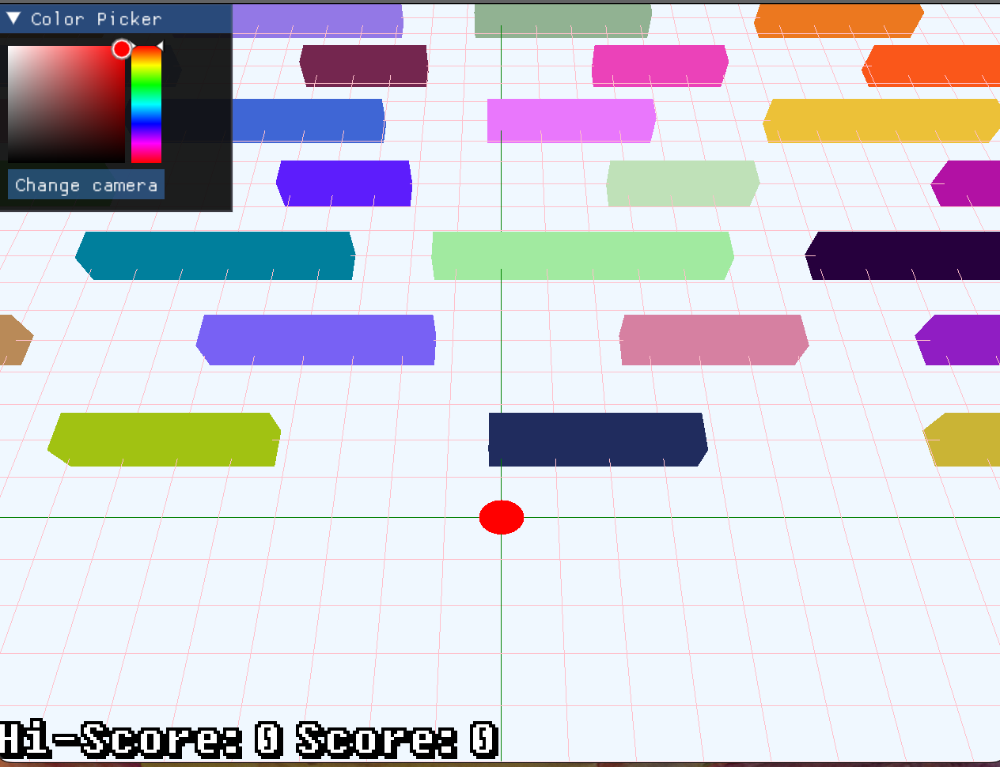

# Crossy-road

## Description

This is a simple crossy-road style game, bulit using threepp (a c++ port of three.js). Where the player is a sphere and the obstacles, are all different 
colored boxes of different sizes. Every time the app is restarted the obstacles will be of a different sizes and colors. You can also change the 
color of the player using the interface in the top right corner. Where you also can change the camera for a different experience. It is not endless, but you can still improve your score if you make it to the end 
and want to go for a new high-score. 

The game builds on Windows, Linux and MacOS

## Dependencies

- Threepp library built using vcpkg
- ImGui library
- Call CMake with `-DCMAKE_TOOLCHAIN_FILE=[path to vcpkg]/scripts/buildsystems/vcpkg.cmake`

## Usage

1. Ensure that the Threepp and ImGui libraries are properly installed and linked.
2. Compile the code.
3. Run the executable file.

## How to play
- You can move the player by using the wasd or arrow keys, and r to reset the position of the player. 
- You earn points by passing a line of obstalces.
- If you collide with an obstacle, your score will be reset,but you can still see your Hi-score from your attempts.
- If you make it to 20 points, the player will reset to the start position, but your score willnot reset. 
- There is also a button for changing the camera position for a harder but more imersive game. 
- You can also change the color of the player, using the imgui element above the camera button. 

### Screenshots

